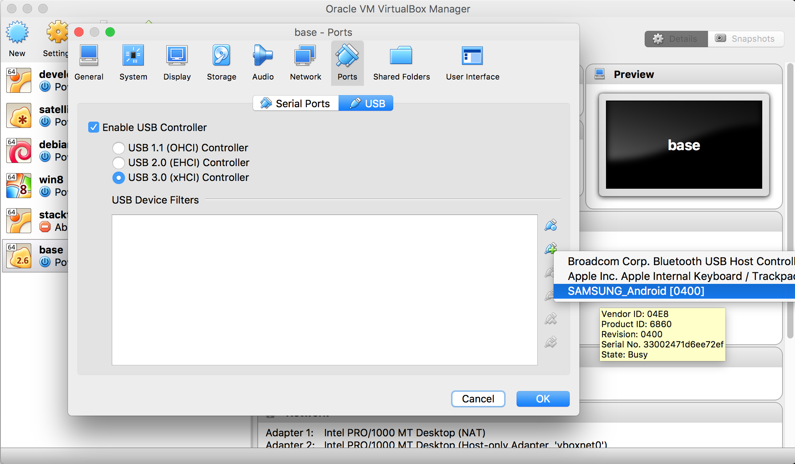

PoC for STF deployment on a single machine
===========
# Installation

* install docker
* install docker-compose
* clone this repo

# Usage
choose an IP your deployment should use, usually that will be the IP of your host.  
choose a secret to be used for inter-service authentication.  
Update the `.env` file accordingly

Run `docker-compose up -d --build`  
Point your browser to the IP you chose,  
login by providing any username and valid e-mail.


A little write-up on this setup:  
https://medium.com/@nikosch86/getting-started-with-automated-in-house-testing-on-android-smartphones-using-stf-dafecee4a8ee  
If you clap it will make me happy :)

# Running on Mac OSX

```bash
# Install virtualbox
brew cask install virtual box

# Install extension pack
curl -Lo ./Oracle_VM_VirtualBox_Extension_Pack-6.0.8.vbox-extpack https://download.virtualbox.org/virtualbox/6.0.8/Oracle_VM_VirtualBox_Extension_Pack-6.0.8.vbox-extpack
open Oracle_VM_VirtualBox_Extension_Pack-6.0.8.vbox-extpack
```

[mobile devices under Mac Os X to connect to Docker](https://stackoverflow.com/questions/29776333/mobile-devices-under-mac-os-x-to-connect-to-docker)

* have the mobile phone connected to the host system.
```bash
$ ioreg -p IOUSB | grep SAMSUNG
+-o SAMSUNG_Android@14100000  <class AppleUSBDevice, id 0x100000c66, registered, matched, active, busy 0 (13 ms), retain 34>
```

* create the a docker machine with the virtualbox driver (I've named it base)
```bash
docker-machine create --driver virtualbox base
```

* stop the machine to enable the USB Controller on the VM
```bash
docker-machine stop base
```



```bash
docker-machine start base
IP_BASE=$(docker-machine ip base)
eval $(docker-machine env base)
```

```bash
PUBLIC_IP=$IP_BASE docker-compose up -d --build
```

```bash
open "http://$IP_BASE"
```

```bash
docker-machine ssh base
tce-load -wi usb-utils
```