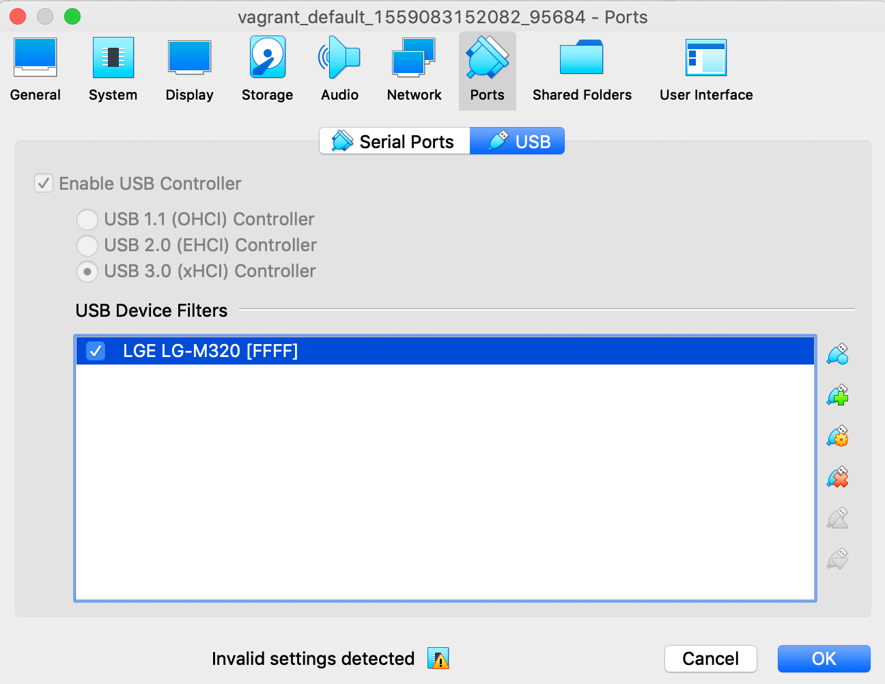

```bash
vagrant up
vagrant halt
```
connect device to USB first\


```bash
vagrant up
sudo su

root@ubuntu-bionic:/home/vagrant# lsusb
Bus 002 Device 001: ID 1d6b:0003 Linux Foundation 3.0 root hub
Bus 001 Device 003: ID 1004:61f9 LG Electronics, Inc. Optimus (Various Models) MTP Mode
Bus 001 Device 001: ID 1d6b:0002 Linux Foundation 2.0 root hub

apt-get update
apt-get install android-tools-adb android-tools-fastboot

root@ubuntu-bionic:/home/vagrant# adb devices
List of devices attached
LGM320FY8HPJYPIFI7	device

root@ubuntu-bionic:/home/vagrant# adb kill-server
```
